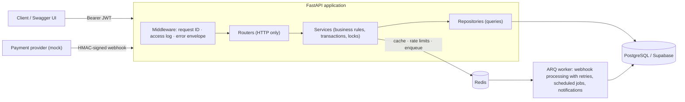
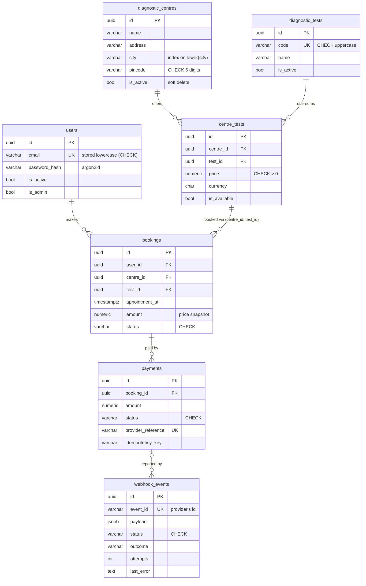
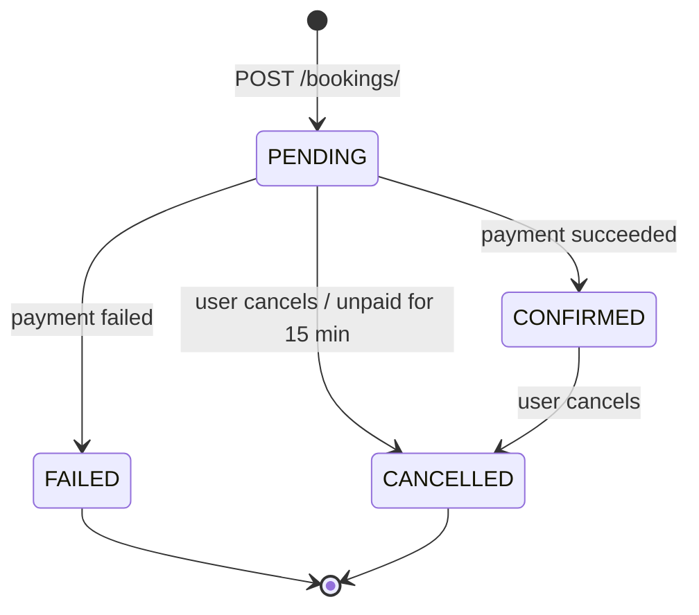
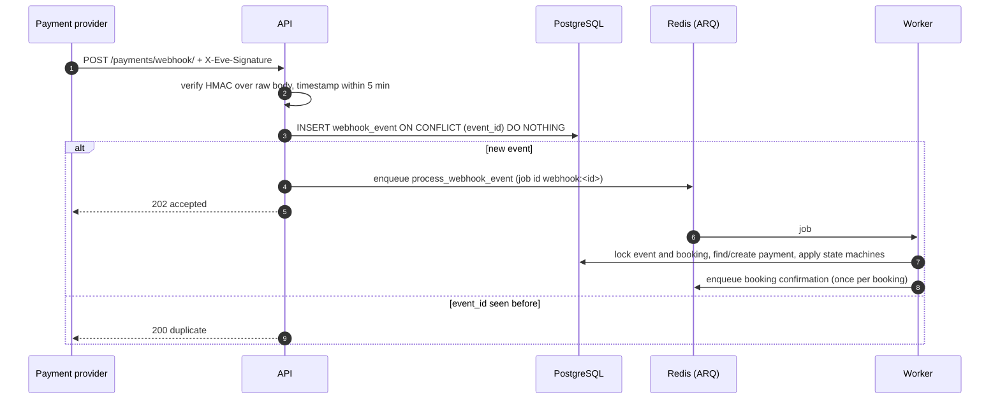

# EVE Diagnostics API

Backend for booking diagnostic tests at partner centres and paying for them through a
simulated payment gateway, with an idempotent, signed provider webhook.

**Stack:** Python 3.13 · FastAPI · SQLAlchemy 2 (async, psycopg 3) · PostgreSQL 16 (Supabase-ready) ·
Redis 7 · ARQ worker · Alembic · uv · Docker · GitHub Actions

| | |
|---|---|
| **Run it** | `cp .env.example .env && docker compose up --build`, then `scripts/demo.sh` |
| **Explore it** | Swagger UI at <http://localhost:8000/docs> (ReDoc at `/redoc`) |
| **Quality** | 298 tests (unit, integration, concurrency) · 99% coverage · ruff · mypy `--strict` · CI |

All optional bonuses are implemented: Redis caching, background jobs, Docker & docker-compose,
OpenAPI docs, unit/integration tests, structured logging, pagination, rate limiting, and
webhook retry handling.

---

## Contents

1. [Quick start](#1-quick-start)
2. [Architecture](#2-architecture)
3. [Database design](#3-database-design)
4. [Payments and the idempotent webhook](#4-payments-and-the-idempotent-webhook)
5. [API reference and example requests](#5-api-reference-and-example-requests)
6. [Edge cases](#6-edge-cases)
7. [Cross-cutting features](#7-cross-cutting-features)
8. [Testing](#8-testing)
9. [Configuration](#9-configuration)
10. [Assumptions](#10-assumptions)
11. [What I would improve with more time](#11-what-i-would-improve-with-more-time)

---

## 1. Quick start

### With Docker (recommended - nothing else to install)

```bash
cp .env.example .env
docker compose up --build                 # Postgres, Redis, migrations, API, worker
docker compose exec api eve seed          # demo centres, tests and prices
scripts/demo.sh                           # end-to-end walkthrough of every requirement
```

Then open <http://localhost:8000/docs>. To use the admin endpoints, create an admin:

```bash
docker compose exec -e ADMIN_PASSWORD='Admin12345' api eve create-admin --email admin@example.com
```

`migrate` runs `alembic upgrade head` once and exits; `api` and `worker` start only after it
succeeds, so replicas never race on migrations.

### Native (for development)

Requires [uv](https://docs.astral.sh/uv/) (it installs Python 3.13 itself), plus PostgreSQL
and Redis - `docker compose up -d db redis` provides both on the ports `.env.example` uses.

```bash
uv sync                                   # virtualenv + dependencies from uv.lock
uv run pre-commit install                 # ruff, mypy and lockfile checks on every commit
cp .env.example .env
make migrate && make seed
make dev                                  # API with auto-reload on :8000
make worker                               # background worker (second terminal)
```

### Tests

```bash
make test        # uv run pytest --cov
```

Needs only Docker: the suite starts throwaway Postgres and Redis containers (Testcontainers)
and never reads `.env`, so it cannot touch a real database. To reuse running servers instead,
set `TEST_DATABASE_URL` / `TEST_REDIS_URL` (CI does this with service containers).
`make check` runs everything CI runs: lint, type-check, tests.

### Running on Supabase

First create the role the application runs as. In the Supabase SQL editor, which connects
as `postgres`:

```sql
create role eve_app login password '<password>';
grant usage, create on schema public to eve_app;
```

`eve_app` is a plain login role - no superuser, no `CREATEROLE`, no `BYPASSRLS`, no
membership of `anon`, `authenticated` or `service_role`. It owns the tables it creates and
nothing else, which is what makes the RLS posture below hold. Then set in `.env`, using the
pooler's `<role>.<ref>` username form:

```bash
DATABASE_URL=postgresql://eve_app.<ref>:<password>@aws-0-<region>.pooler.supabase.com:6543/postgres?sslmode=require
MIGRATIONS_DATABASE_URL=postgresql://eve_app.<ref>:<password>@aws-0-<region>.pooler.supabase.com:5432/postgres?sslmode=require
```

For the compose stack, put the same values in `DOCKER_DATABASE_URL` /
`DOCKER_MIGRATIONS_DATABASE_URL` and remove `COMPOSE_PROFILES=local-db`. Four Supabase
specifics are accounted for:

- **Pooler-safe driver settings.** The app uses the Supavisor transaction pooler (port 6543),
  which cannot hold server-side prepared statements, so psycopg runs with
  `prepare_threshold=None` (plus `pool_pre_ping`). Migrations use the session pooler, which
  supports everything Alembic needs. Row locks work unchanged because each lock lives inside
  one transaction; the code deliberately avoids session-level features such as advisory locks.
- **The public Data API is closed.** Supabase exposes every table in `public` through
  PostgREST. Every migration enables row-level security with no policies, so the `anon` and
  `authenticated` roles can do nothing; the API connects as `eve_app`, a least-privileged
  role that owns these tables and nothing else, so as their owner it is unaffected (RLS is
  enabled, not forced). A test fails if any table lacks RLS. Supabase's linter reports each
  of those tables as `rls_enabled_no_policy` (INFO) - the intended posture here, not an
  oversight: this API never reaches the database through PostgREST, so a policy would only
  widen the surface.
- **Platform hardening lives outside the migration chain.** The project ships an `ensure_rls`
  event trigger whose `SECURITY DEFINER` function `public.rls_auto_enable()` enables RLS on
  any newly created table - harmless belt and braces next to the explicit `ENABLE ROW LEVEL
  SECURITY` in each migration, so it stays. Its grants are the problem: Postgres grants
  EXECUTE to `PUBLIC` and Supabase to `anon` / `authenticated` / `service_role`, publishing
  it at `/rest/v1/rpc/rls_auto_enable`. Nothing there is exploitable - a function returning
  `event_trigger` cannot be invoked from SQL - but it is a needless `SECURITY DEFINER` entry
  point in the exposed schema, and the only WARN in the project's advisories.
  [`scripts/harden_supabase.sql`](scripts/harden_supabase.sql) revokes those grants; it is
  idempotent and verifies its own effect by re-reading the ACL. It is a one-time script
  rather than a migration on purpose: the function is owned by `postgres`, `eve_app` cannot
  revoke grants on an object it does not own, and a migration that cannot succeed as the
  migration role would only break `alembic upgrade head`. Run it as `postgres`, from the
  Supabase SQL editor.
- **Plain `postgresql://` URLs**, as shown in the Supabase dashboard, are accepted and routed
  to the psycopg driver.

---

## 2. Architecture



**Layering.** Each feature (`auth`, `catalog`, `bookings`, `payments`) is a package with the
same files: `models` → `schemas` → `repository` → `service` → `router`.

- **Routers** only translate HTTP: parse and validate input, resolve dependencies, set status codes.
- **Services** hold every business rule and own the transaction boundary. They know nothing
  about HTTP, which is why the ARQ worker and the CLI reuse them unchanged.
- **Repositories** hold queries; **models** hold data and database constraints.
- Dependencies are injected with FastAPI's `Depends` (e.g. `PaymentService(session, gateway,
  queue)`), so tests swap the payment gateway or task queue without patching internals.

```
src/eve/
  main.py              app factory, lifespan (engine, Redis, queue, rate limiter)
  api/                 v1 router, shared dependencies, rate limiting, health probes
  core/                settings, db (Base, UTCDateTime), errors, logging, middleware,
                       pagination, cache, queue, state machine, security (hashing, JWT)
  auth/ catalog/ bookings/ payments/     feature packages (+ jobs.py for background work)
  worker/              ARQ entry point: registered jobs and cron schedule
  cli/                 `eve seed | create-admin | send-webhook`
migrations/            Alembic revisions 0001-0005
tests/unit/            pure logic: state machines, signatures, tokens, backoff, schemas
tests/integration/     HTTP API, worker, scheduled jobs, cache, rate limits, concurrency
```

---

## 3. Database design



Every table also has `created_at` / `updated_at` (`timestamptz`, UTC).

| Decision | Why |
|---|---|
| **Price lives on `centre_tests`** (the offering), not on the test | The same test costs different amounts at different centres. `UNIQUE(centre_id, test_id)`. |
| **Composite FK** `bookings(centre_id, test_id) → centre_tests` | The database itself refuses a booking for a test the centre does not offer. |
| **`bookings.amount` is a snapshot** | Later price changes never alter an existing booking; the client never sends a price. |
| **Partial unique index** on bookings `(user, centre, test, appointment_at) WHERE status IN ('PENDING','CONFIRMED')` | Double-submits cannot create two bookings even under concurrency, yet rebooking after a failure or cancellation works. |
| **Partial unique index** on payments `(booking_id) WHERE status = 'SUCCESS'` | A booking can never be recorded as paid twice - enforced below the application. |
| `UNIQUE(payments.provider_reference)`, `UNIQUE(webhook_events.event_id)` | Identity of payments and provider events; the basis of webhook idempotency. |
| **UUIDv7 primary keys** | Unguessable IDs (no enumeration, no leaked row counts) that are still time-ordered, so B-tree inserts stay append-only unlike random UUIDv4. |
| **`NUMERIC(10,2)` for money**, `Decimal` in Python, strings in JSON | No floating-point rounding. |
| **Status = `VARCHAR` + named `CHECK`**, not native Postgres enums | Adding a state is a plain migration (`ALTER TYPE` has transactional caveats). |
| **Soft delete** (`is_active`) for centres and tests; FKs are `ON DELETE RESTRICT` | Booking and payment history always references valid rows. |
| **`timestamptz`, always returned in UTC** | A custom column type refuses naive datetimes and normalises reads, so API output does not depend on the database session's time zone. |
| **Deterministic constraint names** (naming convention) | Stable, reviewable Alembic migrations; services map specific constraint violations to precise 409 errors. |
| **Indexes** on `lower(city)`, `centre_tests.test_id`, `bookings(user_id, created_at)`, `bookings(status, created_at)`, `webhook_events(status, created_at)` | Each backs a real query: filters, "my bookings", and the two scheduled jobs. |

A test runs `alembic check` against the migrated test database, so a model change without a
migration fails the build; migrations are also exercised on every test run.

---

## 4. Payments and the idempotent webhook

### Booking state machine



Payments move `PENDING → SUCCESS | FAILED` (both terminal). Every status change in the code
goes through one `StateMachine` table: an illegal transition is a `409`, and moving to the
status an object already has is a **no-op** - the property that makes repeated requests and
redelivered events safe.

### `POST /payments/` - simulated charge

1. **Lock the booking row** (`SELECT … FOR UPDATE`). Concurrent attempts to pay the same
   booking are serialised; only the first sees it `PENDING`.
2. If the `Idempotency-Key` header matches an earlier attempt, return that payment
   (`200`, `Idempotent-Replayed: true`) - a client retrying after a timeout gets the original
   result instead of a confusing `409`.
3. Refuse anything but a `PENDING` booking with a future appointment (`409`).
4. Charge the **booking's snapshotted amount** through the `PaymentGateway` protocol.
   `MockPaymentGateway` uses Stripe-style test payment methods: `mock_card_success`,
   `mock_card_declined`, or `mock_card_random` (approved with `MOCK_PAYMENT_SUCCESS_RATE`).
5. `apply_payment_result()` - the single function every payment path uses - records the
   result and moves the booking to `CONFIRMED` or `FAILED`. A declined card is still `201`:
   the request succeeded, the payment did not.
6. After commit, queue the confirmation notification.

### `POST /payments/webhook/` - provider events



The response only means *stored durably*; processing is asynchronous. **Duplicates cannot
corrupt state** because five independent mechanisms would each have to fail:

| # | Mechanism | Stops |
|---|---|---|
| 1 | HMAC-SHA256 signature over `"{timestamp}.{raw body}"`, constant-time compare, 5-minute window | Forged events and replayed captures |
| 2 | `UNIQUE(webhook_events.event_id)` + `INSERT … ON CONFLICT DO NOTHING` | The same event being stored or applied twice (atomic, even for simultaneous deliveries) |
| 3 | `UNIQUE(payments.provider_reference)`; deterministic ARQ job ids | A payment or processing job being created twice |
| 4 | State machines: terminal states never regress, same-status is a no-op | A late `payment.failed` undoing a success; repeats changing anything |
| 5 | Row locks + at most one `SUCCESS` payment per booking | Concurrent deliveries or jobs racing each other |

Processing records an explicit outcome for every case:

| Situation | Result |
|---|---|
| Success/failure for a `PENDING` booking | `applied` - payment and booking updated |
| Result already recorded (e.g. the API call and the webhook both report one payment) | `already_applied` - no-op |
| `payment.failed` after `payment.succeeded` | `conflicting_status` - ignored, warning logged |
| Success for a booking already cancelled or failed (e.g. expired unpaid) | Payment recorded truthfully, booking unchanged, `refund_required` warning |
| A second, different successful charge for a paid booking | Not recorded as success (database forbids it), `duplicate_charge_refund_required` |
| Unknown booking, amount/currency mismatch, reference belonging to another booking, invalid payload | Event `FAILED` with the reason - kept for investigation, not retried |
| Unknown event type or extra fields | Accepted and ignored - rejecting would only make the provider retry forever |

**Retries.** Unexpected failures (database outage, bug) are retried by the worker with
exponential backoff and jitter (2 s, 4 s, 8 s … capped); after `WEBHOOK_MAX_ATTEMPTS` the event
is **dead-lettered** (`FAILED` + `last_error`). Admins list them with
`GET /payments/webhook/events/?status=FAILED` and re-run one with
`POST /payments/webhook/events/{id}/replay/`. If Redis is down when an event arrives, the event
is still stored and acknowledged; a scheduled sweeper re-queues events stuck in `RECEIVED` -
the inbox table, not the queue, is the source of truth.

**Scheduled jobs** (ARQ cron, `unique` so several workers never double-run a tick):
`expire_unpaid_bookings` every 5 minutes cancels `PENDING` bookings past the 15-minute payment
window, using `FOR UPDATE SKIP LOCKED` to step around bookings an in-flight payment is holding;
`requeue_stale_webhook_events` every minute.

---

## 5. API reference and example requests

All routes are under `/api/v1`. Full schemas, examples and error responses: `/docs`.

| Method | Path | Access | Description |
|---|---|---|---|
| POST | `/auth/signup/` | public · 5/min per IP | Create account; returns user + tokens |
| POST | `/auth/login/` | public · 5/min per IP | Email + password → access & refresh tokens |
| POST | `/auth/refresh/` | refresh token | New access token |
| GET | `/auth/me/` | user | Current profile |
| GET | `/centres/` | public · cached | Paginated; `city`, `test_id`, `q` filters |
| GET | `/centres/{id}/` | public · cached | Centre with bookable tests and prices |
| POST · PATCH · DELETE | `/centres/…` | admin | Create, update, soft-delete centres |
| POST · PATCH | `/centres/{id}/tests/…` | admin | Offer a test at a centre / change price or availability |
| GET | `/tests/`, `/tests/{id}/` | public · cached | Test catalog, `q` search |
| POST · PATCH | `/tests/…` | admin | Create / update tests |
| POST | `/bookings/` | user | Book a test → `PENDING` |
| GET | `/bookings/`, `/bookings/{id}/` | owner (admin: all) | Paginated, `status` filter |
| POST | `/bookings/{id}/cancel/` | owner | Idempotent cancel |
| POST | `/payments/` | owner · 10/min per user | Simulated payment; optional `Idempotency-Key` |
| GET | `/payments/`, `/payments/{id}/` | owner (admin: all) | Payment history |
| POST | `/payments/webhook/` | HMAC signature | Provider events |
| GET | `/payments/webhook/events/` | admin | Inbox / dead-letter queue |
| POST | `/payments/webhook/events/{id}/replay/` | admin | Re-process an event |
| GET | `/health/live/`, `/health/ready/` | public | Liveness; readiness checks Postgres and Redis |

### Example session

```bash
API=http://localhost:8000/api/v1

# 1. Sign up (the response includes an access token)
TOKEN=$(curl -s -X POST $API/auth/signup/ -H 'Content-Type: application/json' \
  -d '{"email":"asha@example.com","password":"Password123","full_name":"Asha Verma"}' \
  | python3 -c 'import sys,json; print(json.load(sys.stdin)["tokens"]["access_token"])')

# 2. Find a centre offering a test
curl -s "$API/centres/?city=mumbai&size=5"
curl -s "$API/centres/<centre_id>/"          # tests offered there, with prices

# 3. Book it (any UTC offset is accepted; responses are UTC)
curl -s -X POST $API/bookings/ -H "Authorization: Bearer $TOKEN" -H 'Content-Type: application/json' \
  -d '{"centre_id":"<centre_id>","test_id":"<test_id>","appointment_at":"2026-10-01T09:30:00+05:30"}'
# → 201 {"id": "...", "status": "PENDING", "amount": "349.00", "currency": "INR", ...}

# 4. Pay (retry-safe with an Idempotency-Key)
curl -s -X POST $API/payments/ -H "Authorization: Bearer $TOKEN" -H 'Content-Type: application/json' \
  -H 'Idempotency-Key: checkout-7f3a' \
  -d '{"booking_id":"<booking_id>","payment_method":"mock_card_success"}'
# → 201 {"status": "SUCCESS", "booking": {"status": "CONFIRMED"}, ...}
```

### Sending a provider webhook

The simplest way is the bundled mock provider, which signs with `WEBHOOK_SECRET`:

```bash
docker compose exec api eve send-webhook --booking-id <id> --outcome succeeded --amount 349.00 --repeat 3
# delivery 1: HTTP 202 {"status":"accepted", ...}
# delivery 2: HTTP 200 {"status":"duplicate", ...}
```

Or by hand - the signature is `HMAC-SHA256(secret, "<unix time>.<raw body>")`:

```bash
BODY='{"event_id":"evt_1","type":"payment.succeeded","created_at":"2026-09-26T10:00:00Z",
"data":{"provider_reference":"mock_pay_1","booking_id":"<id>","amount":"349.00","currency":"INR"}}'
TS=$(date +%s)
SIG=$(printf '%s.%s' "$TS" "$BODY" | openssl dgst -sha256 -hmac "$WEBHOOK_SECRET" | awk '{print $NF}')
curl -s -X POST $API/payments/webhook/ -H 'Content-Type: application/json' \
  -H "X-Eve-Signature: t=$TS,v1=$SIG" -d "$BODY"
```

### Errors

Every error - including validation, 404 and 500 - uses one envelope:

```json
{"error": {"code": "BOOKING_NOT_PAYABLE", "message": "Only PENDING bookings can be paid",
           "details": {"booking_status": "CONFIRMED"}},
 "request_id": "01a0dd7e887a7da2b824c6078413df21"}
```

The `request_id` is also returned as `X-Request-ID` and appears on every log line of that
request. Validation errors list the offending fields but never echo submitted values
(which could be passwords); a 500 never reveals internals.

---

## 6. Edge cases

| Case | Behaviour |
|---|---|
| Invalid input (bad email, weak password, 3-decimal price, naive datetime, unknown field) | `422` listing each field; unknown fields are rejected, so clients cannot set `is_admin`, `amount` or `status` |
| Malformed or unknown IDs | Malformed UUID → `422`; well-formed but unknown → `404` |
| Another user's booking or payment | `404`, not `403` - the response does not confirm the resource exists |
| Non-admin on admin routes / no token | `403` / `401` with `WWW-Authenticate: Bearer` |
| Expired, tampered, `alg: none`, wrong-audience or refresh-instead-of-access token | `401` (`TOKEN_EXPIRED` / `INVALID_TOKEN`); algorithm is pinned server-side |
| Login with unknown email vs wrong password | Identical `401`, and equal timing (a dummy hash is verified) - no account enumeration |
| Duplicate email in any letter case, including simultaneous signups | `409 EMAIL_TAKEN` (unique constraint, not check-then-insert) |
| Double-clicked booking | One booking; the rest `409 DUPLICATE_BOOKING` |
| Test not offered / offering paused / centre or test deactivated | `422 OFFERING_UNAVAILABLE` |
| Appointment in the past, inside the 30-min lead time, or > 60 days ahead | `422 INVALID_APPOINTMENT_TIME` |
| Paying a booking that is not `PENDING`, twice, or after its appointment | `409`; with 8 parallel payment requests the gateway is charged exactly once |
| Payment retried after a network timeout | Same `Idempotency-Key` → original payment returned (`200`) |
| Declined card | `201` with payment `FAILED`; booking `FAILED` (user rebooks) |
| Cancel twice / cancel a failed booking / cancel after the appointment | `200` (idempotent) / `409` / `409` |
| Payment and cancellation racing | Serialised by the row lock; the final state is always consistent (tested) |
| Unpaid booking | Cancelled after 15 minutes, releasing the slot |
| Repeated, forged, stale, conflicting or malformed webhooks | See [section 4](#4-payments-and-the-idempotent-webhook) |
| Too many requests | `429 RATE_LIMITED` with `Retry-After` |
| Redis down | API stays up: catalog reads bypass the cache, rate limits fail open, webhooks are stored and swept later; readiness reports `503` |
| Database constraint violated despite application checks | Mapped to the matching `409`, never a `500` |

---

## 7. Cross-cutting features

- **Structured logging (structlog).** JSON in containers, readable console output locally.
  Uvicorn, SQLAlchemy, Alembic and ARQ logs go through the same formatter. Every line of a
  request carries its `request_id` (and `user_id` once authenticated); worker lines carry the
  job id. A caller-supplied `X-Request-ID` is accepted only if log-safe (no newlines, bounded
  length). Domain events are named (`booking.created`, `payment.charged`,
  `webhook.duplicate`, `webhook.dead_lettered`, `booking.expired`, …); patient emails are
  masked (`a***@example.com`).
- **Caching (Redis).** Cache-aside for public catalog reads, with versioned keys
  (`catalog:v{N}:…`): every catalog write bumps the version, invalidating all catalog entries
  in O(1) and preventing a slow reader from re-caching stale data. Responses carry
  `X-Cache: HIT | MISS | BYPASS`. Bookings and payments are never cached.
- **Rate limiting.** Sliding-window counters from the `limits` library on the shared Redis
  pool: per IP for signup and login (slows password guessing), per user for payments.
  `X-RateLimit-Limit/Remaining/Reset` on every response. Behind a proxy, only
  `FORWARDED_ALLOW_IPS` may set the client address, so it cannot be spoofed to dodge limits.
- **Pagination.** `page` / `size` (max 100) with `total` and `pages`; every listing has a
  deterministic `ORDER BY` so rows never repeat or vanish between pages.
- **Security.** Argon2id password hashing (upgraded transparently when parameters change,
  maximum length bounded to prevent hash-flooding), JWTs with `iss`/`aud`/`jti`/`type` claims,
  secrets redacted from the settings' `repr`, non-root container, RLS on Supabase.

---

## 8. Testing

298 tests, ~99% line and branch coverage (CI fails below 90%):

- **Unit** - state-machine transition tables, webhook signatures (tampering, replay window,
  key rotation), JWT edge cases, backoff maths, schema validation, cache failure modes.
- **Integration** - the HTTP API through `httpx` against **real PostgreSQL and Redis**:
  locks, partial indexes and `ON CONFLICT` behave differently on other databases, so nothing
  is mocked at that layer. Background jobs run in a real in-process ARQ worker, covering
  retry-until-success, dead-lettering, replay and the scheduled jobs (including a
  `SKIP LOCKED` test with a second connection holding a lock).
- **Concurrency** - parallel requests with `asyncio.gather`: double payments, simultaneous
  webhook deliveries, concurrent worker jobs, double-clicked bookings, racing signups,
  payment vs cancellation. These are mutation-checked: removing the booking row lock makes
  the payment test fail (the gateway is charged 8 times instead of once).
- **Schema guards** - models match migrations (`alembic check`); every table has RLS; every
  API operation is documented.
- Warnings are errors, so deprecations and leaked connections fail the build.

CI (GitHub Actions) runs three jobs on every push and pull request: pre-commit hooks (ruff,
mypy `--strict`, lockfile and `requirements.txt` freshness, secret detection), the test suite
against Postgres and Redis service containers, and a Docker image build.

---

## 9. Configuration

All settings are environment variables (or `.env`); `.env.example` documents every one.

| Variable | Default | Purpose |
|---|---|---|
| `DATABASE_URL` | required | App connection (Supabase: transaction pooler) |
| `MIGRATIONS_DATABASE_URL` | `DATABASE_URL` | Alembic connection (Supabase: session pooler) |
| `REDIS_URL` | `redis://localhost:6379/0` | Queue, cache, rate limits |
| `JWT_SECRET_KEY` · `WEBHOOK_SECRET` | required, ≥ 32 chars | Token signing · webhook HMAC |
| `ACCESS_TOKEN_TTL_MINUTES` · `REFRESH_TOKEN_TTL_DAYS` | 15 · 7 | Token lifetimes |
| `BOOKING_MIN_LEAD_MINUTES` · `BOOKING_MAX_DAYS_AHEAD` | 30 · 60 | Bookable window |
| `BOOKING_PAYMENT_WINDOW_MINUTES` | 15 | Unpaid bookings expire after this |
| `MOCK_PAYMENT_SUCCESS_RATE` | 0.8 | Approval rate of `mock_card_random` |
| `WEBHOOK_TOLERANCE_SECONDS` | 300 | Signature replay window |
| `WEBHOOK_MAX_ATTEMPTS` · `WEBHOOK_RETRY_BASE_SECONDS` · `WEBHOOK_RETRY_MAX_SECONDS` | 5 · 2 · 300 | Retry policy before dead-lettering |
| `WEBHOOK_STALE_AFTER_SECONDS` | 120 | When an unprocessed event is re-queued |
| `CATALOG_CACHE_TTL_SECONDS` | 300 | Upper bound on cache staleness |
| `RATE_LIMIT_ENABLED` · `RATE_LIMIT_SIGNUP` · `RATE_LIMIT_LOGIN` · `RATE_LIMIT_PAYMENTS` | on · 5/min · 5/min · 10/min | Rate limits |
| `LOG_LEVEL` · `LOG_FORMAT` | INFO · json | `console` for local reading |

The app refuses to start with a missing secret, a too-short secret or a malformed rate limit.

---

## 10. Assumptions

- A single currency (INR). Amounts are stored per row with a currency code, so adding more
  is a data change plus conversion rules.
- The catalog is publicly readable; only admins (`is_admin`, created with the CLI) manage it.
- A booking is for the account holder; there are no separate patient profiles or dependants.
- No slot capacity or centre opening hours: any time in the bookable window is accepted.
  Uniqueness is per user and slot.
- A failed payment ends the booking (`FAILED`); the user books again. This keeps the state
  machine simple and releases the slot.
- Unpaid bookings expire after 15 minutes.
- Cancelling a paid booking is allowed; the refund itself is out of scope, as is acting on
  `refund_required` / `duplicate_charge_refund_required` events (they are logged and kept).
- The payment provider is simulated: the gateway answers synchronously, and provider events
  are sent with the `eve send-webhook` CLI.
- Refresh tokens are stateless and valid until expiry (not rotated or revocable).

---

## 11. What I would improve with more time

- **Real gateway integration.** Commit the `PENDING` payment, call the provider *outside*
  the row lock, and let the webhook be the authority for the result. With the mock the call
  is instant, so holding the lock is harmless; with a real network call it would not be.
- **Transactional outbox** for notifications and other post-commit side effects, so they
  are guaranteed rather than best-effort when Redis is unavailable at commit time.
- **Refund workflow** acting on `refund_required` outcomes and paid-booking cancellations.
- **Slots and capacity:** centre opening hours, per-slot capacity, and slot holds during
  checkout.
- **Refresh-token rotation with reuse detection** and logout (a `jti` denylist in Redis).
- **Observability:** OpenTelemetry traces across API → queue → worker, Prometheus metrics
  (latency, queue depth, dead letters), alerting on dead-lettered events.
- **Search at scale:** keyset pagination for deep pages, `pg_trgm` indexes for name search,
  PostGIS for "centres near me".
- **Finer-grained access control** (centre staff roles), an audit log of admin changes, and
  field-level encryption for sensitive patient data.
- **Load testing** (k6 or Locust) to size the connection pools and worker concurrency.
